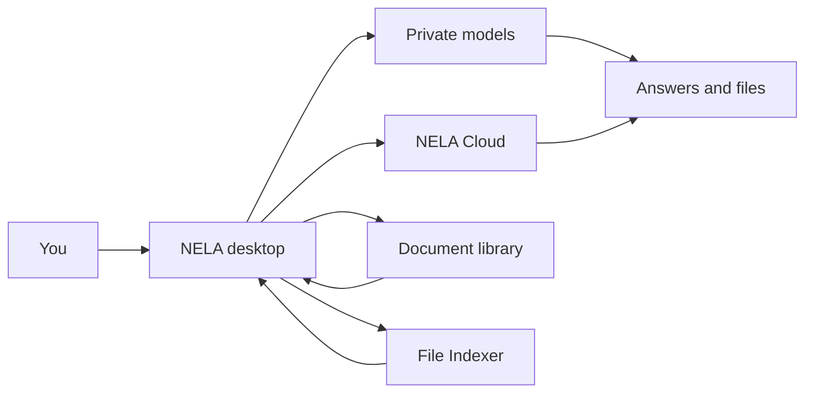

# How it fits together

A light picture of NELA — enough to orient yourself, not a systems manual.

- **Private** — models on this device.
- **Cloud** — optional hosted Fast / Smart / Deep.
- **Document library** — curated uploads for grounded Q&A.
- **File Indexer** — smart search over folders (flagship retrieval).
- **Artifacts** — decks, sheets, HTML, Word from Chat.

For day-to-day use, start with [Welcome](/docs/what-is-it) and the [File Indexer](/docs/features/file-indexer). Deeper Private generation notes live under [Private inference](/docs/features/private-inference).
